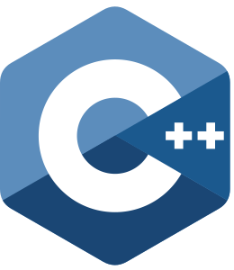

    
    <h1 align='center'>Hi, I'm Alex</h1>
    
 I am a XXXXXXXXXXXXXX.

    
Welcome to my Github.

<table>
<tr>
<th>
<h2 align='left'>About Me</h2>
</th>
<th>
<h2 align='right'>Skills</h2>
</th>
</tr>
<tr>
<td>
  
🌍 Toronto, Canada    
⚙️ Software Developer at Geotab  
🏫 Computer Science at Sheridan College     
🔭 Interested in Data Science and Performance Cars   
📫 Connections: <a href='https://www.linkedin.com/in/-alexandercarvalho/'>LinkedIn</a> | <a href='https://alexandercarvalho.ca'>Website</a>
</td>
<td align="right">
 

 

 

</td>
</tr>
</table>

Check out some of my projects below!
